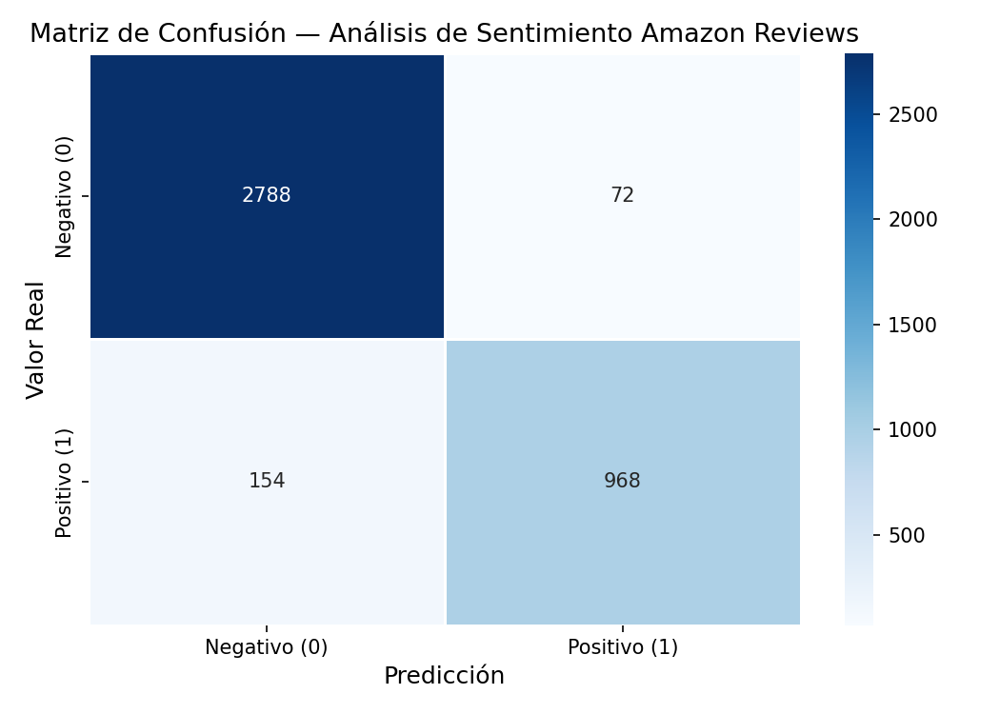
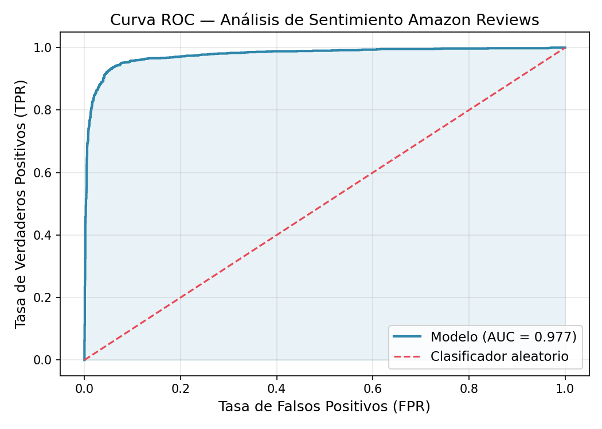
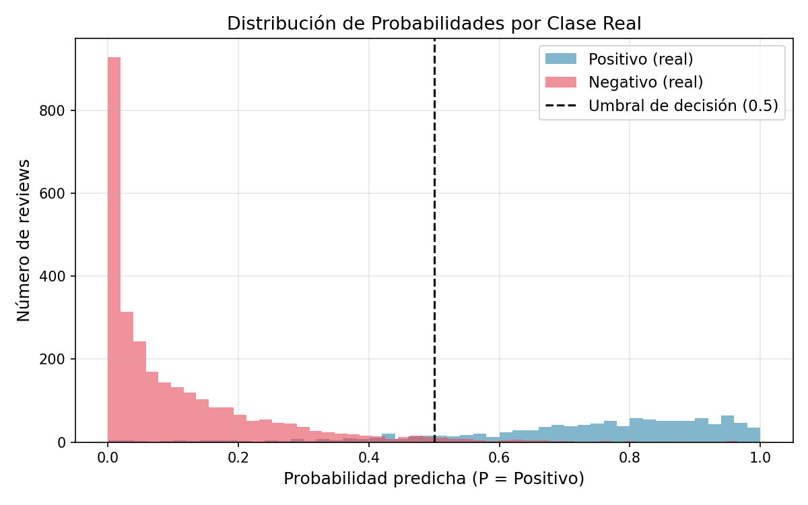

# Case Study: Amazon Reviews — Sentiment Analysis Pipeline

> **Instrucciones para Claude / web builder:**
> Este archivo describe un caso de estudio completo para incluir en un portfolio web personal.
> La carpeta contiene este `.md` y tres imágenes de resultados reales del modelo:
> - `confusion_matrix.png`
> - `roc_curve.png`
> - `probability_distribution.png`
>
> El caso de estudio debe presentarse como una página de portfolio técnica, visualmente limpia,
> con secciones bien diferenciadas. Las imágenes deben mostrarse integradas en el flujo del texto
> con sus explicaciones. El tono es profesional pero accesible — orientado a reclutadores técnicos
> y data engineers senior que valoran las decisiones de diseño, no solo los resultados.

---

## Metadata del proyecto

| Campo | Valor |
|---|---|
| **Título** | Amazon Reviews — Sentiment Analysis Pipeline |
| **Tipo** | Proyecto de portfolio · ETL + Machine Learning end-to-end |
| **Stack principal** | Python 3.11 · PySpark 3.5 · MLlib · FastAPI · Docker |
| **Dataset** | ~21.000 reseñas reales de Amazon |
| **Resultado clave** | Accuracy 94.32% · AUC-ROC 97.74% · F1-Score 89.55% |

---

## 1. Descripción del proyecto

Pipeline de análisis de sentimiento construido de principio a fin: desde la ingesta de un CSV
con ~21.000 reseñas de Amazon hasta un modelo entrenado, evaluado y servido como API REST en producción,
todo orquestado con Docker y ejecutable con un único comando.

El objetivo del proyecto no es solo entrenar un modelo con buenas métricas, sino demostrar
conocimiento de arquitectura de datos: cómo se diseña un pipeline distribuido, cómo se previene
el data leakage, cómo se expone un modelo en producción de forma robusta, y cómo se garantiza
la calidad con tests automatizados.

---

## 2. Arquitectura del pipeline (4 fases)

El pipeline está dividido en cuatro módulos Python independientes, cada uno con una responsabilidad única:

```
CSV (Amazon Reviews ~21k filas)
             │
             ▼
┌────────────────────────┐
│  PHASE 1 — Ingesta     │  · SparkSession local[*] · validación de esquema fail-fast
└───────────┬────────────┘
            │
            ▼
┌────────────────────────┐
│  PHASE 2 — Transform   │  · Parseo de rating con regex · etiquetado binario
│                        │  · Limpieza de texto (5 pasos) · combinación título+cuerpo
└───────────┬────────────┘
            │
            ▼
┌────────────────────────┐
│  PHASE 3 — Train       │  · Split 80/20 · Pipeline MLlib (5 etapas encadenadas)
│                        │  · Cross-Validation 3-fold · búsqueda de hiperparámetros
└───────────┬────────────┘
            │
            ▼
┌────────────────────────┐
│  PHASE 4 — Evaluate    │  · F1, AUC-ROC, Precision, Recall, Accuracy
│                        │  · Matriz de confusión · Curva ROC · Dist. probabilidades
└───────────┬────────────┘
            │
     ┌──────┴──────┐
     ▼             ▼
 ./outputs/     ./models/
 (gráficos      (modelo PySpark
  + métricas)    serializado)
```

Cada fase se puede ejecutar de forma aislada o como pipeline completo. Las cuatro fases están
empaquetadas en contenedores Docker independientes con responsabilidades separadas:
pipeline de entrenamiento, API de inferencia, demo interactiva y suite de tests.

---

## 3. Ingesta y transformación de datos (Phase 1 y 2)

### Lectura tolerante a errores con PySpark

El CSV de Amazon tiene peculiaridades que rompen lectores estándar: reviews con saltos de línea
internos, comillas anidadas, y filas con codificación corrupta. La ingesta usa tres flags críticos:

- `multiLine=true` para reviews que contienen `\n` dentro del texto
- `escape='"'` para comillas anidadas en el contenido
- `mode=PERMISSIVE` para que filas corruptas no detengan toda la ingesta

### Etiquetado binario

Las reviews de rating 3 se excluyen explícitamente — no se clasifican como neutras ni como ninguna
de las dos clases. Incluirlas introduce ruido: el mismo texto ("funciona, pero la entrega tardó mucho")
puede acompañar tanto un 3 como un 4 dependiendo del usuario.

| Rating | Clase | Label |
|---|---|---|
| 4 y 5 estrellas | Positivo | `1` |
| 3 estrellas | **Excluido** | `null` |
| 1 y 2 estrellas | Negativo | `0` |

### Pipeline de limpieza de texto (5 pasos en cascada)

```
"Great Product!" → minúsculas → "great product!"
                → eliminar HTML → "great product!"
                → solo alfanumérico → "great product "
                → colapsar espacios → "great product "
                → trim → "great product"
```

Cada paso usa `F.regexp_replace()`, que ejecuta las transformaciones en los executors de Spark
(no en el driver), manteniendo la escalabilidad distribuida independientemente del tamaño del dataset.

---

## 4. Entrenamiento del modelo (Phase 3)

### Pipeline de MLlib — 5 etapas encadenadas

Un `Pipeline` de PySpark garantiza que las mismas transformaciones se aplican de forma idéntica
a train y test, eliminando cualquier posibilidad de data leakage.

```
review_combined (texto limpio)
       │
       │  Tokenizer          → ["great", "product", "i", "love", "it"]
       │  StopWordsRemover   → ["great", "product", "love"]
       │  HashingTF          → SparseVector(65536, {12483: 1.0, 34521: 1.0, 58901: 1.0})
       │  IDF                → SparseVector(65536, {12483: 2.31, 34521: 1.87, 58901: 3.14})
       │  LogisticRegression
       ▼
prediction: 1.0  │  probability: [0.08, 0.92]
```

**Por qué HashingTF en lugar de CountVectorizer:** `CountVectorizer` necesita construir el vocabulario
completo en memoria durante el `fit()`. `HashingTF` aplica una función hash directamente sobre cada
token — coste de memoria constante, sin vocabulario — con `numFeatures=65.536` (2¹⁶) para minimizar
colisiones en vocabularios de hasta ~50k palabras.

**Por qué IDF:** pondera cada término por su rareza en el corpus. "amazon" aparece en casi todas
las reviews → peso bajo. "broken" aparece solo en reviews negativas → peso discriminativo alto.

### Cross-Validation con búsqueda de hiperparámetros

```
ParamGrid:
  regParam        = [0.01, 0.1]    ← penalización L2
  elasticNetParam = [0.0,  0.5]    ← mezcla L1/L2

Total: 4 combinaciones × 3 folds = 12 entrenamientos
Métrica de selección: AUC-ROC
```

La CV evalúa cada combinación en 3 particiones distintas del training set y promedia los resultados.
Esto produce una estimación robusta del rendimiento que no sobreajusta a una partición de validación
concreta.

---

## 5. Resultados del modelo (Phase 4)

### Métricas finales — evaluado sobre 3.982 ejemplos nunca vistos

| Métrica | Resultado | Umbral de producción |
|---|---|---|
| **Accuracy** | **94.32%** | — |
| **F1-Score** | **89.55%** | > 85% ✅ |
| **AUC-ROC** | **97.74%** | — |
| **Precision** | **93.08%** | — |
| **Recall** | **86.27%** | — |

> Test set: 3.982 muestras · 1.122 positivas · 2.860 negativas

---

### Matriz de confusión



La matriz de confusión desglosa las 4 categorías de predicción sobre el conjunto de test:

| | Predicho Negativo | Predicho Positivo |
|---|---|---|
| **Real Negativo** | Verdadero Negativo (TN) | Falso Positivo (FP) |
| **Real Positivo** | Falso Negativo (FN) | Verdadero Positivo (TP) |

En un sistema de análisis de reviews de producto, un **Falso Positivo** (review negativa clasificada
como positiva) tiene mayor coste reputacional que un Falso Negativo — puede esconder problemas
de calidad. La Precision alta del 93.08% refleja que el modelo es conservador a la hora de etiquetar
algo como positivo.

El umbral de decisión de 0.5 es ajustable sin reentrenar el modelo: bajar el umbral aumenta el Recall
(menos FN) a costa de Precision (más FP), y viceversa, dependiendo del caso de uso.

---

### Curva ROC



La curva ROC muestra el tradeoff entre Tasa de Verdaderos Positivos (TPR) y Tasa de Falsos Positivos
(FPR) para todos los umbrales de clasificación posibles.

- La **línea diagonal** representa un clasificador aleatorio (AUC = 0.50)
- La **curva del modelo** (AUC = **0.9774**) se acerca al ángulo superior izquierdo: máxima discriminación
- Un AUC > 0.97 significa que, tomando una review positiva y una negativa al azar, el modelo asigna
  mayor probabilidad a la positiva en el 97% de los casos

Un AUC de 0.9774 es considerado excelente para clasificación binaria de texto en NLP.

---

### Distribución de probabilidades



Histograma de P(positivo) separado por clase real. Revela la **calibración** del modelo:

- **Clase positiva (real):** masa de probabilidad concentrada cerca de 1.0 → el modelo es seguro al predecir positivos
- **Clase negativa (real):** masa de probabilidad concentrada cerca de 0.0 → el modelo es seguro al predecir negativos
- **Solapamiento en torno a 0.5:** zona de incertidumbre — reviews con lenguaje mixto o ambiguo

La separación clara entre ambas distribuciones confirma que el modelo está bien calibrado:
no solo acierta, sino que lo hace con confianza alta. Un modelo mal calibrado acertaría pero
con probabilidades cercanas a 0.5, lo que sería problemático en producción.

---

## 6. API de inferencia en producción

El modelo entrenado se expone como servicio REST con FastAPI, levantable con `docker-compose up api`.

### Endpoints

| Método | Endpoint | Descripción |
|---|---|---|
| `GET` | `/health` | Liveness probe compatible con Kubernetes |
| `GET` | `/model/info` | Metadatos del modelo activo (auditoría) |
| `POST` | `/predict` | Clasificar una review individual |
| `POST` | `/predict/batch` | Clasificar hasta 100 reviews en paralelo |

### Ejemplo de respuesta

```json
{
  "sentiment": "positive",
  "label": 1,
  "confidence": 0.9821,
  "probabilities": {
    "positive": 0.9821,
    "negative": 0.0179
  }
}
```

### Decisiones de diseño en producción

- **Singleton de modelo:** `PipelineModel` y `SparkSession` se cargan una sola vez en el startup
  y persisten entre peticiones. Sin overhead de JVM por request.
- **Validación con Pydantic:** peticiones malformadas son rechazadas con `422 Unprocessable Entity`
  antes de llegar al modelo.
- **Health check estructurado:** reporta si el modelo está cargado y Spark activo — compatible con
  readiness/liveness probes de Kubernetes.

---

## 7. Demo interactiva — HuggingFace Spaces

La demo permite probar el modelo con cualquier review de Amazon desde el navegador sin instalar nada.

HuggingFace Spaces no tiene Java disponible, lo que hace PySpark inviable como runtime de servicio.
El patrón implementado es el estándar en producción:

```
Entrenar a escala (PySpark) → Exportar ligero (sklearn/joblib) → Servir sin JVM (Gradio/FastAPI)
```

El modelo exportado usa `TfidfVectorizer + LogisticRegression` de scikit-learn — funcionalmente
equivalente al pipeline PySpark, pero sin ninguna dependencia de Java. Ocupa ~5-10 MB como `.joblib`.

---

## 8. Suite de tests automatizados

| Archivo | Tipo | Qué verifica |
|---|---|---|
| `test_transform.py` | Unitario | Cada función de transformación de forma aislada |
| `test_api.py` | Integración | Todos los endpoints: códigos HTTP, esquemas, validaciones |
| `test_model_quality.py` | Regresión | El modelo supera umbrales mínimos sobre un golden set |

El **golden set** son 14 reviews con etiquetas conocidas: 5 claramente positivas, 5 claramente negativas,
4 casos límite (sin título, texto muy corto, lenguaje mixto). Si `test_model_quality.py` falla,
el modelo no debe desplegarse a producción — el mismo patrón que usan Spotify, Netflix y Airbnb
en sus pipelines de ML.

---

## 9. Decisiones técnicas clave

### ¿Por qué PySpark y no Pandas + scikit-learn?

El dataset de 21k filas cabe en memoria, pero la arquitectura es idéntica a la de millones de reviews
en un cluster real. El mismo código que corre en `local[*]` escala a un cluster de producción cambiando
solo la variable `SPARK_MASTER` en `docker-compose.yml`. Esto demuestra que se entiende la diferencia
entre "código que funciona" y "arquitectura que escala".

### ¿Por qué TF-IDF y no BERT?

En clasificación de sentimiento con ratings como etiqueta (señal fuerte y limpia), TF-IDF + Logistic
Regression rara vez es superado de forma significativa por modelos más complejos. BERT requiere GPU
y no es nativo en PySpark. TF-IDF es la elección correcta para demostrar dominio del proceso sin
ocultar la lógica en una caja negra — y con 94.32% de accuracy, los resultados hablan por sí solos.

### ¿Por qué Cross-Validation en lugar de un único split?

Un único split de validación puede producir una partición atípica que genera estimaciones demasiado
optimistas o pesimistas. La CV de k-folds evalúa el modelo en k particiones distintas y promedia,
produciendo una estimación robusta y honesta del rendimiento real.

---

## 10. Stack tecnológico completo

| Tecnología | Versión | Rol |
|---|---|---|
| Python | 3.11 | Lenguaje del pipeline |
| PySpark | 3.5.1 | Procesamiento distribuido + MLlib |
| OpenJDK | 17 | Runtime de Java para Spark |
| scikit-learn | 1.5.0 | Métricas de evaluación + exportación ligera |
| Matplotlib / Seaborn | 3.9 / 0.13 | Visualizaciones de evaluación |
| FastAPI | 0.111 | API REST de inferencia en producción |
| Uvicorn | 0.30 | Servidor ASGI |
| Gradio | 4.36 | Demo interactiva en HuggingFace Spaces |
| pytest | 8.2 | Suite de tests (unitarios + integración + regresión) |
| Docker + Compose | ≥ 24 | Contenedorización, reproducibilidad, multi-servicio |

---

## 11. Guía para construir la página web de este caso de estudio

### Estructura sugerida de la página

1. **Hero / cabecera** — Título, stack de tecnologías (badges/chips), enlace al repo GitHub
2. **Resumen ejecutivo** — 2-3 frases sobre qué hace el proyecto y por qué es relevante
3. **Métricas destacadas** — Cards o stat blocks con los 5 KPIs (Accuracy, F1, AUC, Precision, Recall)
4. **Arquitectura** — Diagrama del pipeline de 4 fases (se puede renderizar el ASCII o vectorizarlo)
5. **Visualizaciones del modelo** — Las 3 imágenes con sus explicaciones (sección de resultados)
6. **Componentes técnicos** — Transformación de datos, pipeline MLlib, API, tests
7. **Decisiones de diseño** — Por qué PySpark, TF-IDF, CV — sección que demuestra razonamiento técnico
8. **Stack tecnológico** — Tabla o grid de badges de tecnologías

### Imágenes disponibles en esta carpeta

| Archivo | Qué muestra | Dónde usar |
|---|---|---|
| `confusion_matrix.png` | Matriz 2×2 con TP/TN/FP/FN sobre 3.982 muestras | Sección de resultados del modelo |
| `roc_curve.png` | Curva ROC azul vs. diagonal aleatoria, AUC=0.9774 anotado | Sección de resultados del modelo |
| `probability_distribution.png` | Histograma de P(positivo) separado por clase real | Sección de calibración del modelo |

### Tono y audiencia objetivo

- **Audiencia:** reclutadores técnicos, data engineers, ML engineers
- **Tono:** profesional y directo; sin palabrería de marketing
- **Énfasis:** las decisiones de arquitectura y el razonamiento técnico pesan más que los números

### Paleta de colores sugerida

El proyecto usa colores oscuros y profesionales. Si se quiere coherencia visual con las gráficas:
- Fondo oscuro o gris muy oscuro (`#0d1117` estilo GitHub Dark)
- Acento azul para highlights (`#2563eb` o similar)
- Texto claro (`#e6edf3`)
- Cards/bloques de métricas con contraste medio-alto

---

*Generado el 2026-04-27 · Proyecto de portfolio — Análisis de sentimiento con PySpark MLlib*
